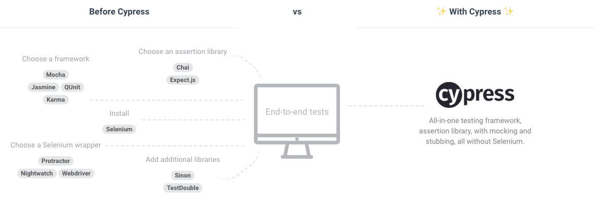

###### Last Update: Monday 9th 2018

## Checklist

- What is Cypress?
- What makes it different from the tools we have already?
- What are the prominent features it supports?
- Why should I use it over other tools? 
- Are there any alternatives out there?
- When should I use it and when shouldn't I use it?
- Any Caveats in using Cypress?

## Metadata
__Age:__ Approximately 3 Years; [source](http://www.buzzfile.com/business/Cypress.io,-LLC-404-660-2421)

__Tool Type:__ Test Runner (All-In-One)

## TL;DR
Cypress is all-in-one testing framework, that includes all the bells and whistle you'd expect and much more. Plus it's built from the ground up and it's architecture does not rely on Selenium. It's UPS (Unique Selling Point), being a tool to empower developers to write __Flake-Free__ tests.

## Introduction
The Cypress contributors have done a better writing introduction, than I have. So by not reinventing the wheel check out [How does Cypress Works?](https://www.cypress.io/how-it-works/)

## First Impressions
From Day 1, it's was already pretty easy to feel comfortable with testing and simulating user actions. The rest of my thoughts:

- __Gentle Learning Curve__ - if you have ever used jQuery, then using jQuery style selectors and simulating a click should be a breeze. Plus API semantics make the tests both easy to read and write, pretty intuitive I believe. Typing text into an input field example below;
```
cy.get('.shopping-list-input')
  .type('Raspberry Jam')
```
- __Quick Test Writeup__ - up till now if it every came to 
- __Batteries Included__ - it's advertised All-In-One solution, allows you to `npm install` and easily integrate tests to your the project UI on the get go
- __Flexible Configuration__ - imagine a scenario where you've just set up your main config file, however some tests require slightly different configs. Not to mention other bespoke tests that need a specific timeout and viewport size. Guess what? Cypress has all that covered. 
  - 3 ways to configure tests:
    - [Cypress.config](https://docs.cypress.io/api/cypress-api/config.html#Name) - please note that anything you call from Cypress affects global state.
    - [cy.config](https://docs.cypress.io/api/cypress-api/config.html#Notes) - this method affects the local state
    - [cy.tick](https://docs.cypress.io/api/commands/tick.html#) - finally you can use specific methods to configure those bespoke tests written

- __To Headless or not To Headless?__ - That's right! You have a choice, I sometimes go for the Browser option, when developing UI independently, just to makes sure nothing out the ordinary occurs. The __Headless__ option is just as good, with docker support for popular continous integration platforms such as [CircleCI](https://github.com/cypress-io/cypress-example-docker-circle) and [GitLab](https://gitlab.com/cypress-io/cypress-example-docker-gitlab)
- __Flake Free__ - even though it's possible to write flaky tests. Cypress' Architecture applies automatic retries on a `setTimeout` and will keep looping the same test, till the timer ends. Doubly useful for testing parts of the UI that render asynchronously.
- __Covers All the Bases__ - Any framework and all languages. Ruby, Node, C#, PHP - as none of that matters. Cypress tests anything that runs in the context of a browser, thus makes it framework agnostic

## Features
Check out [A test runner built for humans](https://www.cypress.io/features/)

## Caveats
- __Snails Pace__ - honestly you shouldn't be surprising as the tool is used for end-to-end tests and sometimes needs to be slowed down to enable to __automatic retries__ for a test setTimeout to kick in.
  
  __Solutions:__ 
  - __Use a Headless Browser__ - as history has shown running tests within the Native DOM is unsurprisingly slow, this is where running test via virtual DOM is usually recommended
  - __Reduce Timeout for automatic retries__ - Please note that this may affect whether a test is in the bounds of being is flaky or not-flaky, especially for rendering asynchronous components

- __Not a Complete Replacement__ - this relates to the first point on __testing speed__, which is one of the main attributes developers look out for. 

  __Solutions:__ 
  - __Use Another Framework for Unit Testing__ - Cypress can still be used in conjunction with tools such as [Jest]() - which requires little configurational to set up.

- __Not easily Scalable__ - due to the reliance on Mocha, tests are ran sequentially, rather than having the ability to run in parellel. Even though this is a caveat of Mocha, the developer's choice to use the Testing Framework can't be ruled out

  __Solutions:__ None

### DX is Paramount (Developer Experience)
For more ways to combat the caveats and managing a Cypress codebase:

- [When to use Cypress]()
- [Optimising Tests]()
- [Maintaining Tests]()

This covers checklist element(s) below:

- Why should I use it over other tools?
- When should I use it and when shouldn't I use it?
- Any Caveats in using Cypress?

## Alternatives
Within the current JavaScript Ecosystem, there is not really any full replacement for an All-In-One testing framework. Then again if check out what it would have replaced

<br>


<u>__Diagram 1:__ What Cypress claims it can replace</u>

<br>

Nonetheless, the best alternatives would be use `Test Cafe` - note that I haven't used Test Cafe yet, due to the steep pricing. However they do offer a free trial, compared to Cypress free for open-source projects.

### Commissioning Costs
Delving deep into the economics, the cost of time and energy required to setup each framework, integrate an assertion library with accompanying utilities would take time. Not to mention maintainance of each E2E test, being more difficult.

Let's reverse that situation and you had 

## Pricing
For more details on [pricing](https://www.cypress.io/pricing/)
- Public Projects - are completely free
- Private Projects - starting at $99/month

## Licensing
[MIT](https://github.com/cypress-io/cypress/blob/develop/LICENSE.md)

## Miscellaneous
- [FAQ](https://docs.cypress.io/faq/questions/using-cypress-faq.html)
- [Docs and API](https://docs.cypress.io/guides/overview/why-cypress.html#)
- [Recipes](https://docs.cypress.io/examples/examples/recipes.html#)